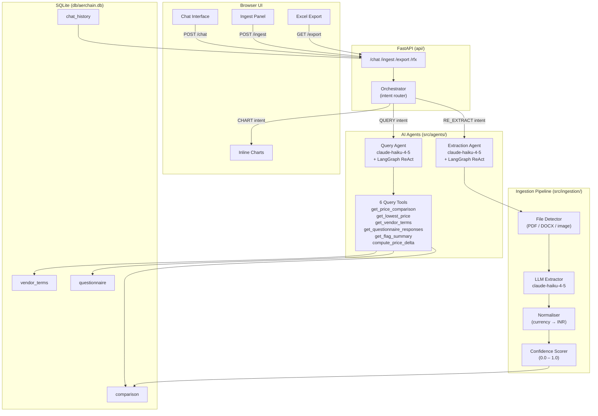
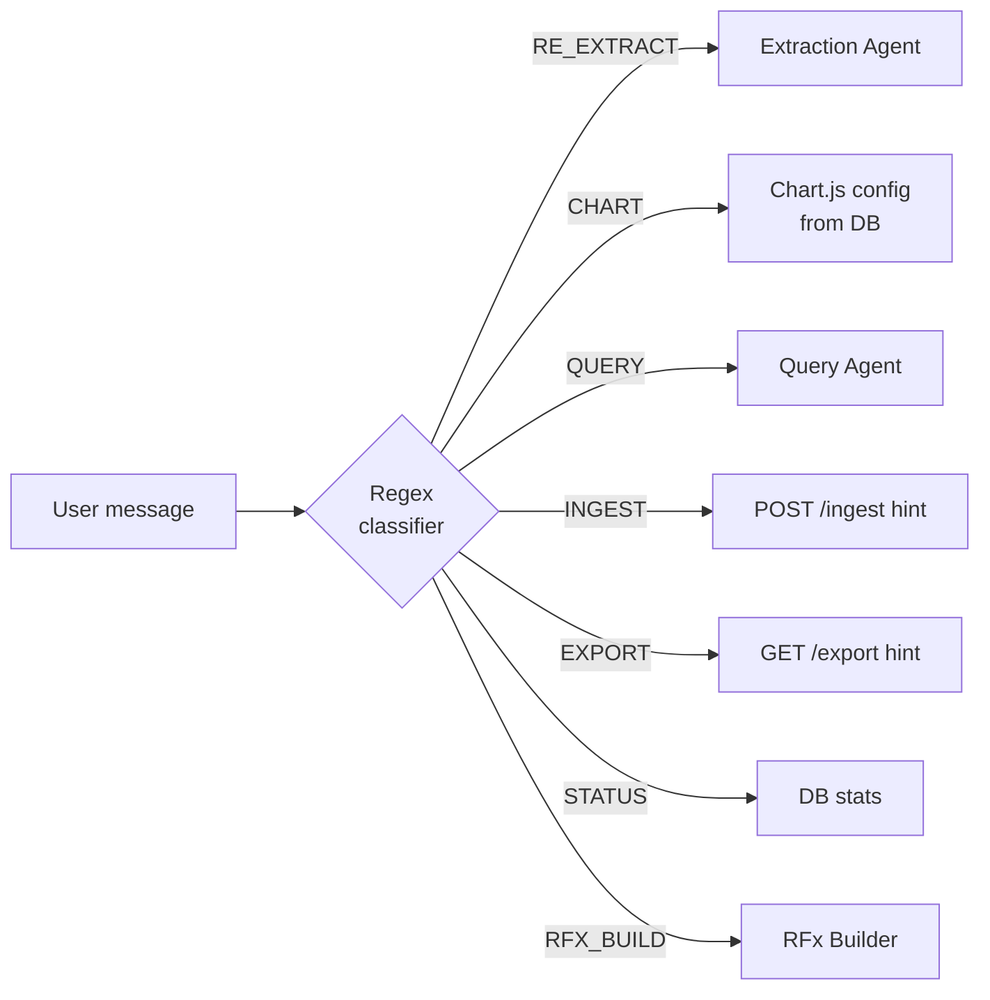
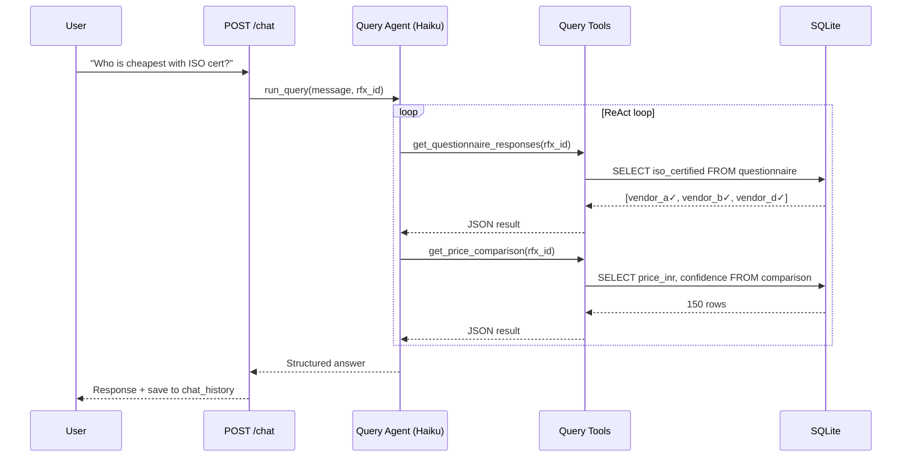
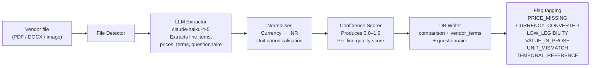
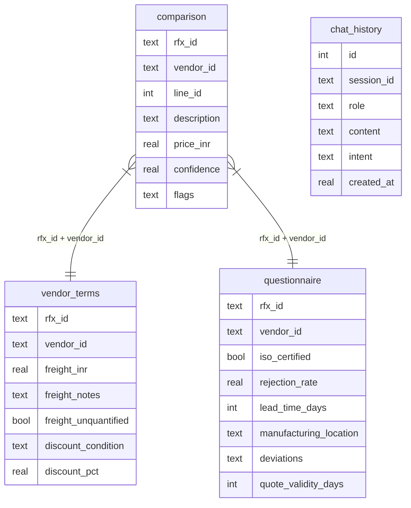

# Aerchain ProcureTech AI

An AI-powered procurement analysis platform that ingests vendor RFx responses, extracts and normalises pricing, and answers complex sourcing questions through a conversational chat interface.

Built as a full-stack proof-of-concept covering document ingestion → structured extraction → LangGraph ReAct query agent → export — evaluated at **86.7% (26/30)** on a 15-question LLM-as-Judge test suite.

---

## Architecture



---

## Intent Routing

The orchestrator classifies every chat message with a deterministic regex router — no LLM overhead on routing.



---

## Query Agent — Tool Loop



---

## Ingestion Pipeline



---

## Data Model



---

## Eval Results — LLM-as-Judge

Agent: `claude-haiku-4-5-20251001` · Judge: `claude-haiku-4-5-20251001` (separate model instance, no self-judging)

| # | Question | Dimension | Score |
|---|----------|-----------|-------|
| Q01 | Cheapest overall | Pricing | 2/2 |
| Q02 | Cheapest for line 7 | Pricing | 1/2 |
| Q03 | Freight terms | Terms | 2/2 |
| Q04 | Volume discounts | Terms | 2/2 |
| Q05 | ISO certification | Questionnaire | 1/2 |
| Q06 | Shortest lead time + ISO | Questionnaire × Questionnaire | 2/2 |
| Q07 | Flag summary | Flags | 2/2 |
| Q08 | Confidence filter | Confidence | 2/2 |
| Q09 | Price delta vendor_a vs vendor_b | Pricing × Pricing | 2/2 |
| Q10 | Split award — questionnaire filter | Pricing × Questionnaire | 1/2 |
| Q11 | Cheapest — confidence ≥ 0.9 | Pricing × Confidence | 2/2 |
| Q12 | ISO-certified vendor lowest price | Pricing × Questionnaire | 1/2 |
| Q13 | Exclude all flagged vendors | Pricing × Flags | 2/2 |
| Q14 | Discount threshold trap | Pricing × Terms | 2/2 |
| Q15 | Split award — ISO + rejection rate | Pricing × Questionnaire | 2/2 |
| | **Total** | | **26/30 (86.7%)** |

Re-run the eval: `venv/bin/python -m tests.eval.llm_judge_eval`

---

## Project Structure

```
aerchain/
├── api/
│   ├── main.py                  # FastAPI app, CORS, router registration
│   ├── static/index.html        # Chat UI (vanilla JS, Chart.js)
│   └── routes/
│       ├── chat.py              # POST /chat, GET /history
│       ├── ingest.py            # POST /ingest, GET /ingest/status
│       ├── export.py            # GET /export  (3-sheet Excel)
│       ├── rfx.py               # POST /rfx/create
│       └── data.py              # GET /data/*  (raw DB access)
├── src/
│   ├── orchestrator.py          # Regex intent router + handler dispatch
│   ├── agents/
│   │   ├── query_agent.py       # LangGraph ReAct — answers questions
│   │   ├── extraction_agent.py  # LangGraph ReAct — re-extracts vendor data
│   │   └── tools/
│   │       └── query_tools.py   # 6 LangChain tools over SQLite
│   ├── ingestion/
│   │   ├── pipeline.py          # Orchestrates per-vendor ingestion
│   │   ├── extractor.py         # LLM extraction (Haiku)
│   │   ├── normaliser.py        # Currency + unit normalisation
│   │   ├── confidence.py        # Per-line confidence scoring
│   │   ├── detector.py          # File type detection
│   │   └── schemas.py           # Pydantic models
│   ├── db/
│   │   ├── connection.py        # aiosqlite pool, table init
│   │   ├── comparison_store.py  # Read/write comparison table
│   │   └── questionnaire_store.py
│   ├── export/
│   │   └── excel.py             # openpyxl 3-sheet report
│   └── rfx/
│       └── builder.py           # RFx document builder
├── tests/
│   ├── eval/
│   │   ├── llm_judge_eval.py    # 15-question LLM-as-Judge eval runner
│   │   └── last_judge_report.json
│   └── ...                      # 156 unit + integration tests
├── data/
│   ├── rfx/                     # RFx JSON definitions
│   └── vendor_responses/        # Raw vendor files (PDF/DOCX/image)
├── db/aerchain.db               # SQLite database (auto-created)
├── requirements.txt
└── .env                         # ANTHROPIC_API_KEY, ANTHROPIC_WORKSPACE_ID
```

---

## Setup

```bash
python -m venv venv
source venv/bin/activate
pip install -r requirements.txt
```

Create `.env`:
```
ANTHROPIC_API_KEY=sk-ant-...
ANTHROPIC_WORKSPACE_ID=wrkspc_...
```

Start the server:
```bash
venv/bin/uvicorn api.main:app --reload --port 8000
```

Open `http://localhost:8000` — the chat UI loads automatically.

---

## API Reference

| Method | Path | Description |
|--------|------|-------------|
| `POST` | `/chat` | Send a message; returns `{response, intent, data}` |
| `GET` | `/chat/history` | Retrieve session chat history |
| `POST` | `/ingest` | Run ingestion pipeline for an RFx |
| `GET` | `/ingest/status` | Check ingestion status for an RFx |
| `GET` | `/export` | Download 3-sheet Excel comparison report |
| `POST` | `/rfx/create` | Build a new RFx document |

---

## Key Design Decisions

**Two-model eval** — the query agent (`claude-haiku-4-5`) is judged by a separate Haiku instance. No model judges its own output, eliminating self-grading bias.

**Deterministic intent routing** — chat messages are classified by regex patterns, not an LLM. Zero latency overhead, fully predictable routing.

**Confidence scoring** — every extracted price carries a 0.0–1.0 confidence score and a list of flags. The query agent uses these to filter unreliable data rather than including it uncritically.

**Case-insensitive vendor IDs** — `VENDOR_E`, `Vendor_E`, and `vendor_e` all resolve to the same DB rows. Normalisation happens in the tool layer, not the DB.
